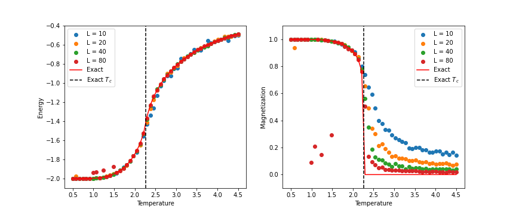
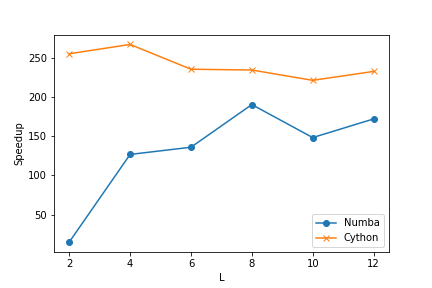

# 2d-ising-mcmc

Simulation of the Ising model on a square lattice with the Metropolis algorithm, which is a Markov chain Monte Carlo method for sampling the equilibrium distribution of a system. In addition to pure Python implementation (`ising.py`), the code is also implemented with Numba (`ising_numba.py`) and in Cython (`ising_cython.pyx`). The Cython code is parallelized with OpenMP.

## Usage

The simulation can be simply run with `python driver.py`. One can change the parameter values therein.

Should any modifications be made to `ising_cython.pyx`, one would need to to run `python setup.py build_ext --inplace` in a CIL to re-compile it to C. Then the function `run_ising_cython(...)` can be imported in any Python script (see e.g., `driver.py`).

## Results

Here's a plot showing the evolution of energy and magnetization expectations with temperature for different system sizes (L = 10, 20, 40, 80).

Another plot showing the performance/speed gain using Numba and Cython, normalized to the pure Python implementation, for different system sizes (L = 2, 4, 6, 8, 10, 12):

Here is a GIF showing the evolution of the spin configuration (80 x 80) as temperature increases:

